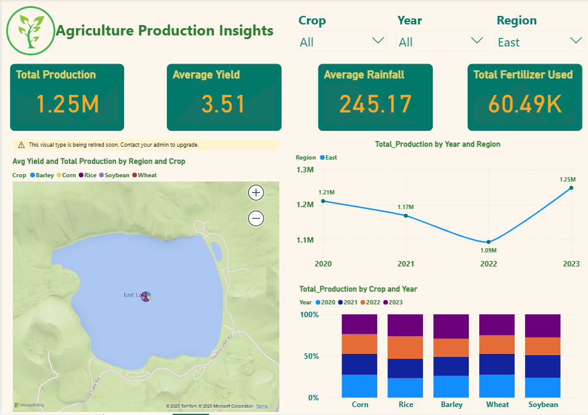

🌾 Agriculture Production Insights Dashboard

## 📌 Overview
This interactive Power BI dashboard provides a comprehensive analysis of agricultural performance across regions and crop types. It enables stakeholders to explore production trends, yield efficiency, rainfall impact, and fertilizer usage through intuitive visuals and dynamic filtering.

---

## 🎯 Objectives
- Analyze year-wise trends in total crop production across regions.
- Identify top-performing regions and crops based on yield.
- Assess the impact of rainfall on agricultural productivity.
- Examine fertilizer usage patterns and their correlation with yield.
- Enable interactive filtering by year, region, and crop for targeted insights.

---

## 📊 Dashboard Features
🔹 KPI Cards
🔹 Filled Map
🔹 Line Chart
🔹 Clustered Column Chart

---

## 🔍 Key Insights
- 🌧️ Regions with optimal rainfall tend to achieve higher yields.
- 🌾 Certain crops maintain high production regardless of rainfall variation.
- ⚠️ Fertilizer overuse in some regions does not improve yield, indicating inefficiency.
- 🌱 Crop dependency in specific regions increases vulnerability to climate risks.

---

🛠 Tools & Technologies
Power BI Desktop DAX (Data Analysis Expressions) for KPIs & calculations CSV file as the data source

---

## 📌 Tooltip Strategy (Power BI)
Each visual includes dynamic tooltips with:
- Region Name
- Crop Type
- Total Production
- Average Yield
Tooltips are designed to enhance user understanding without cluttering the visuals.

---

## 🧭 Conclusion
The Agriculture Production Insights Dashboard offers a data-driven platform for monitoring and improving agricultural outcomes. With clear KPIs, visual correlations, and interactive filters, it empowers decision-makers to optimize resource allocation, policy design, and yield strategies.

---

## 📸 Dashboard Preview

---

## 📢 Author
Created by **[Girish Kumar V](https://github.com/GirishKumarV25)** – Passionate about **data analytics, visualizations**.

